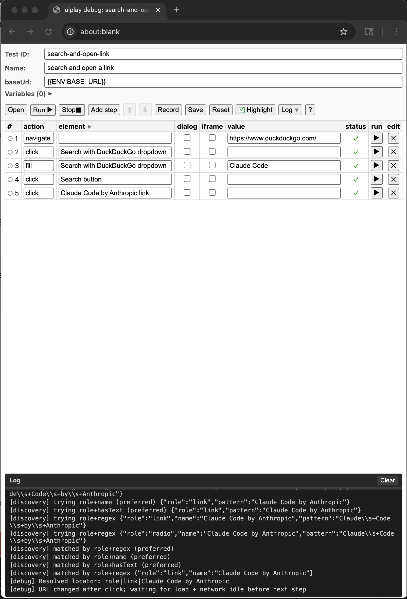

# Text-Driven UI Playback

This framework turns plain-text step lines into runnable Playwright tests:

1. **Write steps** in YAML (or create a test with `init-test`). Steps use action keywords and optional variables.
2. **Discovery** runs the flow in Playwright and records locators into a page object. Once it succeeds, the test is marked established.
3. **Run** executes established tests using page objects only (no exploration).
4. **Debug** opens an interactive UI to run steps one-by-one, add/edit steps, set breakpoints, and save.

## Setup

- **Node**: Use the repo’s existing `npm install`.
- **Playwright**: `npx playwright install`

## Commands

All commands are run via the CLI (from repo root):

```bash
# Create a test case from step lines
npm run uiplay -- init-test my-test "My flow" "Navigate to {{baseUrl}}" "Click Sign in" "Fill Email with test@example.com"

# Run discovery: execute steps and record locators into a page object
npm run uiplay -- discovery my-test --base-url=https://your-app.com/login

# Run an established test (page objects only)
npm run uiplay -- run my-test

# Run all established tests
npm run uiplay -- run-all

# Interactive debug runner (per-step run, breakpoints, edit, save)
npm run uiplay -- debug my-test --base-url=https://your-app.com

# List test cases and page objects
npm run uiplay -- list-tests
npm run uiplay -- list-page-objects
```

## Test case format (YAML)

Test cases are stored as `.yaml` files under `uiplay/tests/`. Each file has **`test_case`** at the root with **`actions`** (step lines). Variables like `{{baseUrl}}`, `{{env:VAR}}`, or names from **`variables`** are substituted at run time:

```yaml
test_case:
  id: my-test
  title: My flow
  established: false
  baseUrl: "{{baseUrl}}"
  env: {}
  variables:
    RUN_ID: "{{timestamp}}"
    RANDOM_SUFFIX: "{{randomStr[6]}}"
  actions:
    - Navigate to {{baseUrl}}
    - Click Sign in button
    - Fill Title input with "My title {{RUN_ID}}"
    - Fill Email address with {{env:PLAYWRIGHT_LOGIN_EMAIL}}
    - Fill Password with {{env:PLAYWRIGHT_LOGIN_PASSWORD}}
    - Click Continue
```

## Action keywords (step line format)

Step lines are parsed by `parseStepLine` and formatted by `formatStepToLine` in `uiplay/engine/step-line.ts`. Every step can optionally end with **` with locator "..."`** to pin a Playwright locator (e.g. `Click Submit with locator "button[type=submit]"`).

| Action | Step line format | Notes |
|--------|------------------|--------|
| **Navigate** | `Navigate to <url>` or `Go to <url>` | |
| **Click** | `Click <element>` | |
| **Click (with value)** | `Click <element> with <value>` | |
| **Double click** | `Double click <element>` | Also: `Double clicks`, `Double-click` |
| **Fill** | `Fill <element> with <value>` | |
| **Enter** | `Enter <value> in <element>` | Same as Fill (value in element). |
| **Select** | `Select <element>` | |
| **Select (option in element)** | `Select <value> in <element>` | |
| **Hover** | `Hover <element>` | |
| **Press** | `Press <key>` | Default key is Enter if omitted in intent. |
| **Assert visible** | `Assert visible <element>` | |
| **Assert text** | `Assert text <element>` | |
| **Wait enabled** | `Wait for <element> to be enabled` | |
| **Upload** | `Upload <file>` | Targets the visible file input (e.g. after clicking "New File(s)"). |
| **Upload to element** | `Upload <file> to <element>` | |
| **Upload with file** | `Upload <element> with <file>` | |
| **Pause (seconds)** | `Pause for N seconds` or `Wait for N seconds` | e.g. `Pause for 10 seconds` |
| **Pause (indefinite)** | `Pause` | Runner waits until you press ENTER in the terminal. |

Existing `.json` test cases are still loaded if no `.yaml` exists for the same id.

## Debug mode
In this mode, user is able to record and playback a script, add and modify indivdual action or playback the whole script


Run **`npm run uiplay -- debug <testId>`** to open the interactive debug UI. You get:

- **Toolbar**: Open (load another test), Run / Resume, Stop, Add step, Record, Save, Reset, Log (expand/collapse), ? (open this README).
- **Steps table**: Edit action, element, value, and optional dialog/iframe flags per step. Run a single step (▶), set breakpoints (○/●), move or delete steps.
- **Log panel**: Execution and resolver output. Clear and expand/collapse without interrupting a run.

All of the **action keywords** in the table above can be used when adding or editing steps in the debug UI. The debug runner supports these step actions (same as discovery/run):

| Action | Use in debug UI |
|--------|------------------|
| **navigate** | `Navigate to <url>` or `Go to <url>` |
| **click** | `Click <element>` or `Click <element> with <value>` |
| **dblclick** | `Double click <element>` |
| **fill** | `Fill <element> with <value>` or `Enter <value> in <element>` |
| **select** | `Select <element>` or `Select <value> in <element>` |
| **hover** | `Hover <element>` |
| **press** | `Press <key>` (e.g. Enter) |
| **assert_visible** | `Assert visible <element>` |
| **assert_text** | `Assert text <element>` |
| **wait_enabled** | `Wait for <element> to be enabled` |
| **upload** | `Upload <file>`, `Upload <file> to <element>`, or `Upload <element> with <file>` |
| **pause** | `Pause for N seconds`, `Wait for N seconds`, or `Pause` (indefinite) |

Any step can end with **` with locator "..."`** to pin a Playwright locator. Variables (`{{baseUrl}}`, `{{env:VAR}}`, `{{VAR}}`, and generator macros) are substituted when you run steps.

## Parameter and variable substitution

Placeholders in URLs and step values are resolved at run time:

- **`{{baseUrl}}`** – Replaced with the resolved base URL (from test `baseUrl` or env `PLAYWRIGHT_LOGIN_URL`).
- **`{{env:VAR_NAME}}`** or **`{{VAR_NAME}}`** – Replaced with the value of env var or a variable from the test’s **`variables`** block (e.g. `{{env:PLAYWRIGHT_LOGIN_EMAIL}}`).
- **Single braces `{param}`** – Resolved from env. Default mapping: `{account_name}` → `PLAYWRIGHT_ACCOUNT_NAME`, `{deploy_id}` → `PLAYWRIGHT_LOGIN_DEPLOY_ID`. Use in URLs (e.g. `PLAYWRIGHT_LOGIN_URL=https://{account_name}.example.com?deploy_id={deploy_id}`).

**Per-test variables** (`test_case.variables`) are evaluated once per run and merged into env. Their values can use these **generator macros** (defined in `uiplay/engine/substitute.ts`):

| Macro | Description |
|-------|-------------|
| `{{timestamp}}` | Shared timestamp for this run (ms since epoch). Case-insensitive. |
| `{{randomInt}}` | Random 6-digit integer. |
| `{{randomInt[N]}}` | Random integer with exactly N digits (e.g. `{{randomInt[4]}}`). |
| `{{randomStr}}` | Random alphanumeric string (8 characters). |
| `{{randomStr[N]}}` | Random alphanumeric string with N characters (e.g. `{{randomStr[6]}}`). |

Variable values can also reference other env/variables via `{{VAR}}` or `{{env:VAR}}` after macros are expanded.

If `baseUrl` is empty or `{{baseUrl}}`, the runner uses `PLAYWRIGHT_LOGIN_URL` from env.

## Directory layout

- **`uiplay/page-objects/`** – Page objects in YAML (one `.yaml` file per page/flow). Each has **`locators`** (logical name → Playwright locator string) and optional **`aliases`** (alternative key → canonical key in `locators`). Existing `.json` page objects are still loaded if no `.yaml` exists for the same id.
- **`uiplay/tests/`** – Test cases in YAML: `test_case` at root with `actions` (step lines) and optional `variables`.
- **`uiplay/recordings/`** – Raw recordings (if using record/translate flows elsewhere).

## Flow summary

| Command | Input | What happens | Output |
|--------|--------|----------------|--------|
| **init-test** | id, title, step lines | Creates a new test case YAML with parsed steps. | Test case file |
| **discovery** | Test ID, optional base-url | Parses step lines, runs Playwright, records locators → page object; test marked established on success. | Page object + established test |
| **run** | Established test ID | Runs test using page object + steps only. | Pass/fail |
| **run-all** | (none) | Runs all established tests. | Pass/fail per test |
| **debug** | Test ID, optional base-url | Opens debug UI: run all, run from step, breakpoints, edit steps, save. | Interactive session |

## Environment variables

- **`PLAYWRIGHT_LOGIN_URL`** – Optional. URL template for login; used when test `baseUrl` is `{{baseUrl}}` or unset (e.g. `https://{account_name}.example.com?deploy_id={deploy_id}`).
- **`PLAYWRIGHT_ACCOUNT_NAME`**, **`PLAYWRIGHT_LOGIN_DEPLOY_ID`** – Used to substitute `{account_name}` and `{deploy_id}` in URLs.
- For step values use `{{env:VAR_NAME}}` (e.g. `{{env:PLAYWRIGHT_LOGIN_EMAIL}}`); the runner substitutes them during discovery and run.

## Self-healing (future)

When a step fails in `run` (e.g. locator no longer valid), you can re-run **discovery** for that test to re-resolve elements and update the page object, then run again with `run`.
